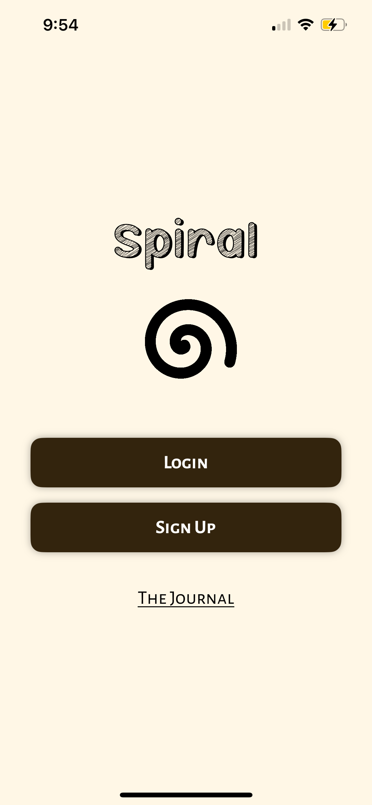
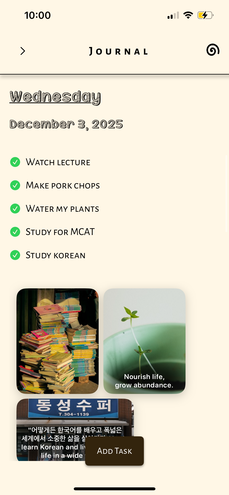
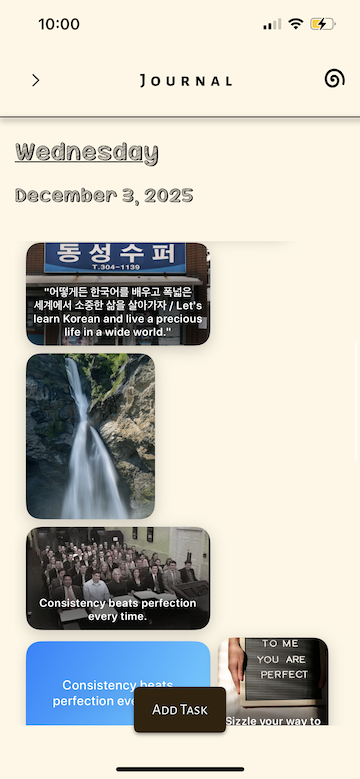

{"id":"58241","variant":"standard","title":"Spiral – README"}
# Spiral ✨  
AI-Powered Bullet Journaling & Visual Inspiration

Spiral is an AI-driven journaling app that transforms your thoughts, tasks, and moods into a visual, interactive bullet journal. It blends productivity and creativity by generating dynamic collages, prompts, and reflections that evolve with your day.

Built for people who want a more mindful, expressive, and consistent journaling experience.

---

## 📱 Features

- AI-generated bullet journal entries
- Smart task organization
- Calendar-based logging
- Secure account creation & data persistence (Firebase)
- Dynamic inspiration collages
- Multiple color modes for full app customization
- Clean, minimalist UI/UX designed in SwiftUI

---

## 🛠️ Tech Stack

- **Frontend:** Swift / SwiftUI
- **Backend & Auth:** Firebase Authentication + Firestore
- **APIs:** Hugging Face, Unsplash, GIPHY, Pixabay
- **Architecture:** MVVM
- **Tools:** Xcode, Git, GitHub

---

## 🚀 Installation & Setup

1. Clone the repository

   git clone https://github.com/algrissette/Spiral-App.git

2. Create a file named `APIKeys.swift` inside the root project folder:

```swift
import Foundation
import SwiftUI

struct APIKeys {
    static let HF_TOKEN = "**insert_key**"
    static let UNSPLASH_KEY = "**insert_key**"
    static let PIXABAY_KEY = "**insert_key**"
    static let GIPHY_KEY = "**insert_key**"
}
```

3. Set up Firebase:
   - Create a Firebase project
   - Add an iOS app to your project
   - Download `GoogleService-Info.plist`
   - Place it in the root of the Xcode project
   - Enable **Authentication** and **Firestore Database**

4. Run the app in Xcode

---

## 🖼️ Screenshots







---

## 🎥 Video Walkthrough

(Coming soon)

---

## 👤 Created & Designed By

**Alan Grissette**  
Creator, Designer & Developer of Spiral  

Philadelphia, PA  
Boston University — B.A. in Computer Science (May 2024)

GitHub: https://github.com/algrissette  
Portfolio: https://alangrissette.com  
LinkedIn: https://linkedin.com/in/alangrissette  
Email: alangrissette02@gmail.com

---

## 🧪 Related Projects

**Uvavine — Full Stack Social Media Platform**  
MERN Stack, WebSockets, OAuth 2.0  
Optimized for 1,000+ daily interactions  
Advanced animation & DOM performance techniques

**PetMate — Pet Rental Web App**  
Blazor + ASP.NET + MongoDB + AWS  
Stripe payments, Google Maps, profiles & reviews  
Scrum Master of Agile development cycle

---


## 📄 License

This project is licensed under the BU License — feel free to fork, explore, and build on top of it.

---

If you like this project, consider giving it a ⭐ on GitHub.
